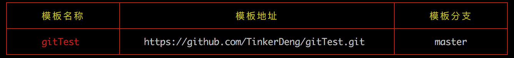

## 目录

* [简介](#简介)
* [使用](#使用)
    * [本地调试][#本地调试]
    * [命令][#命令]

### 简介

> test-node-cli 是一个轻量级的前端项目生成工具，可帮助前端程序员快速生成模板项目

### 使用

### 本地调试
```
    git clone https://github.com/TinkerDeng/test-node-cli.git
    npm install
    npm link
    test-node-cli
```
### 命令

> add | a

```
    test-node-cli add
    模板名称：readme
    模板地址：https://github.com/TinkerDeng/reademe.git
    模板分支：branch
```

> list | l

```
    test-node-cli list
```



> init | i
```
    test-node-cli init
    模板名称：readme
    项目名称：test
```

> delete | d

```
    test-node-cli delete
    模板名称：readme
    模板地址：https://github.com/TinkerDeng/reademe.git
    模板分支：模板分支：branch
```
